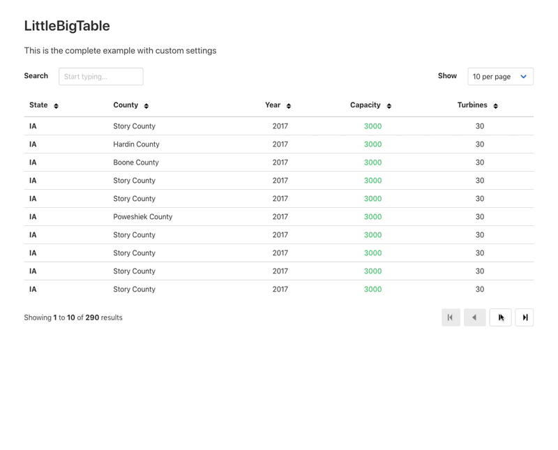

# littleBIGtable

#### littleBIGtable is a small (~5k gzipped) javascript table built using AlpineJS



See the [Complete example](https://littlebigtable.indgy.uk/examples/complete.php) in action, this uses Bulma for the styling as shown above.

*littleBIGtable is very new and while it works well for my purposes you may find issues, please report them in the issue tracker.* 

littleBIGtable is CSS agnostic and can be used with any css framework, the default examples use Bulma, there is also a [Bootstrap example](https://littlebigtable.indgy.uk/examples/bootstrap.php) using Bootstrap 4 and a [Basic example](https://littlebigtable.indgy.uk/examples/basic.php) with no css. I imagine it would be great with TailwindCSS too.

As you have complete control over the HTML you can structure and style it however you wish.

## Goals

 * Allow you the developer to completely control the look and feel of the table by wrapping a standard HTML table in an AlpineJS component.
 * Make the viewing and searching of large remote datasets easy, it does not use local data, it only fetches data from your chosen endpoint.

## Why
I created this as too many table plugins render the table in an opinionated fashion, I wanted to be able to write the table in HTML and 'sprinkle' the javascript over it to make it interactive.

## Changelog

## [0.1.0] - 2021-02-12

First dependable release, I have started using this in Production.

### Added

- New setting [headers](#adding-http-headers) to allow sending custom HTTP headers with the requests.
- New setting [args](#changing-the-url-query-arguments) to allow setting the url query argument names to suit your application.

### Changed

- The default storage key prefix is now capitalised to match the new project name, it was 'lbt' now it is 'lBt', hopefully this makes it more obvious as to what it relates to.

### Fixed

- An issue with the pager display when the total number of results was less than number of results to show 

## Installation

### Using the CDN

Link to the main javascript file

```html
<script src="https://unpkg.com/littlebigtable@0.1.1/dist/littleBIGtable.min.js"></script>
```

If you want to use the supplied icons you must refer to them when passing in your options to the littleBIGtable component:

```js
let opts = {
  icons: "https://unpkg.com/littlebigtable@0.1.1/dist/icons.svg"
}
```
```html
<div x-data="littleBIGtable(opts)" x-init="init()">

</div>
```

### Manually
Copy the `icons.svg` and `littelBIGtable.min.js` files from the dist folder into your project somewhere and add the following script element.

```html
<script src="/path/to/your/folder/littleBIGtable.min.js"></script>
```

You will need to change the icons.svg locations as well, see the examples for details.

```html
<svg><use xlink:href="/path/to/your/install/folder/icons.svg#[name-of-icon]"></use></svg>
```

### Using npm

There is an npm package for littleBIGtable available for install, however it is not recommended until the package is updated.

```sh
npm install littlebigtable
```


## Documentation

### Get started

This is the starting point for all littleBIGtables, you must wrap your table in an AlpineJS component, provide a url to your api endpoint and specify your table columns and rows. The code below is an example of the minium required.

```html
<div x-data="littleBIGtable({url:'/location/of/your/api'})" x-init="init()">
	<table>
		<thead>
			<tr>
				<th>Title</th>
				<th>Year</th>
				<th>Rating</th>
			</tr>	
		</thead>
		<tbody>
			<template x-for="row in rows">
				<tr>
					<td x-text="row.title"></td>
					<td x-text="row.year"></td>
					<td x-text="row.rating"></td>
				</tr>	
			</template>
		</tbody>
	</table>
</div>
<script src="/path/to/alpine.min.js" defer></script>
<script src="/path/to/littleBIGtable.min.js"></script>
```

Check the source of the [Basic example](https://littlebigtable.indgy.uk/examples/basic.php) to see this in action.


### Settings

The following settings can be overriden by passing in an object in the `x-data` attribute:

## Fetching data

littleBIGtable expects a JSON response from your endpoint, the object must contain two properties, an Integer `total` and an Array `data` with total being the total number of rows in the remote dataset and data containing the subset of rows to be displayed.

In PHP you might do something like this:

```php
<?php
// the total number of records in the dataset
$total = 100;
// an array of rows to display
$data = [
	[
		'title' => '...',
		'year' => '...',
		'rating' => '...'
	],
	// etc...
];

echo json_encode([
	'total' => $total,
	'data' => $data
]);
``` 

In the examples folder you'll find a simple PHP JSON server, it can be started on your local machine by using the built in PHP server, type the following into your terminal:

```sh
php -S localhost:8080
```

## Formatting cell contents

Before the cell data is rendered it can be modified using formatters, they are functions that return a string and can be used to add links, classes, show images or anything you can think of.

NB: If you are returning HTML you must us the `x-html` directive on the `<td>` element, if you use `x-text` the HTML will be escaped.

### Creating a formatter

To create a formatter add your function into the formatters setting passed to littleBIGtable. Your function will receive the cell value and the complete row data. Whatever you return will be displayed in the cell.

Assuming you have columns called `year` and `rating` you can create formatters as follows:

```js

let settings = {
	url: '/path/to/your/endpoint',
	formatters: {
		year: function(year, row) {
			if (year < 2000) {
				return `<span class="blue">${year}</span>`;
			}
			return year;
		},
		rating: function(rating, row) {
			if (rating > 4) {
				return `<span class="green">${rating}</span>`;
			}
			if (rating < 3) {
				return `<span class="red">${rating}</span>`;
			}
			return rating;
		}
	}
}


``` 

That example would add the class 'blue' to any year in the last century and add the classes 'red' or 'green' to the rating depending on its value.


## Adding functionality

#### Displaying the statusbar

Show a statusbar to show handy messages to the user, loading state or errors and provide a handy reference to where they are in the results.

Simply add the following somewhere inside your component `<div>`.

`<p x-html="meta.status"></p>`

The statusbar messages can be changed in the settings. There are two types of *summary* text, one displays where the user is in terms of rows visible and total, the other is more book like and shows the current page and total pages.

`Showing rows 1 to 10 of 95 results` or `Showing page 2 of 4`

To choose between the two set the value of `messages.summary` to either `rows` or `pages` when passing your settings.

You can also customise the `loading` and `failed` state messages by passing `messages.loading` and `messages.failed` in your settings. 


#### Adding a row limiter 

Row limiters limit the number of rows displayed at any one time, the default is 25 but any number between 1 and 100 can be chosen. Any value chosen by the user is saved in localStorage and reused. 

Simply add a drop down and add the '' function. This is limited to between 1 and 100 rows.

Check the [Complete example](https://littlebigtable.indgy.uk/examples/complete.php) for more details.

#### Adding a search box

A search box can be used to filter your remote data.

Add the code for the search box, ensuring it is inside the  component div (the one with the x-data attribute) and add the following ''

Check the [Complete example](https://littlebigtable.indgy.uk/examples/complete.php) for more details.

#### Making columns sortable

Columns can be sorted by adding a `<button>` element to toggle the sort direction. 

Add the `<button>` element to your `th` using the `x-html` and `@click` directives ([docs](https://github.com/alpinejs/alpine/#learn)). 

```html
<th>
	Year
	<button 
		type="button" 
		x-html="getSortIcon('year')"
		@click="doSort('year')">
	</button>
</th>
<!-- The above code assumes the year column name is 'year' -->
```

The `getSortIcon()` method will automatically show the correct icon state using an icon from icons.svg.

The `doSort()` method sets the URL sort parameter and fetches the sorted data. The url parameter appears as `&sort=column_name:asc` or  `&sort=column_name:dsc` depending on the requested sort direction.

Check the [Complete example](https://littlebigtable.indgy.uk/examples/complete.php) for more details.

## Adding HTTP headers

If you need to add or adjust the default HTTP headers pass the headers key in the options, the default headers are shown below:
```html
<script>
  let options = {
  headers: {
    'Content-Type': 'application/json',
    'X-Requested-With': 'littleBIGtable'
  },
}
</script>
<div x-data="littleBIGtable(options)" x-init="init()">
  ...
</div>
``` 

## Changing the URL query arguments

If you need to change the default query argument names pass the args key in the options
```html
<script>
let options = {
  args: {
    offset: 'page',
    limit: 'show_per_page',
    search: 'query',
    sort: 'order_by'
  },
}
</script>
<div x-data="littleBIGtable(options)" x-init="init()">
  ...
</div>
``` 

### Custom events

It is possible to create custom event handlers, for example to handle a row 'click' add the `@click` handler to your table rows and provide the name of your custom function which can be included anywhere on the page or in a separate file. 

```html
<tr @click="doSomething($event)" data-id="123">
```

By passing the `$event` 'magic property' ([docs](https://github.com/alpinejs/alpine/#event)) you'll be able to see all the event propeties, for example to get the `data-id` attribute of the above clicked row 

```js
function doSomething(event) {
	console.log('The row was clicked, below is the event and the data-id of the row');
	console.log(event);
	console.log(event.target.parentNode.attributes['data-id'].value);
}

```    
